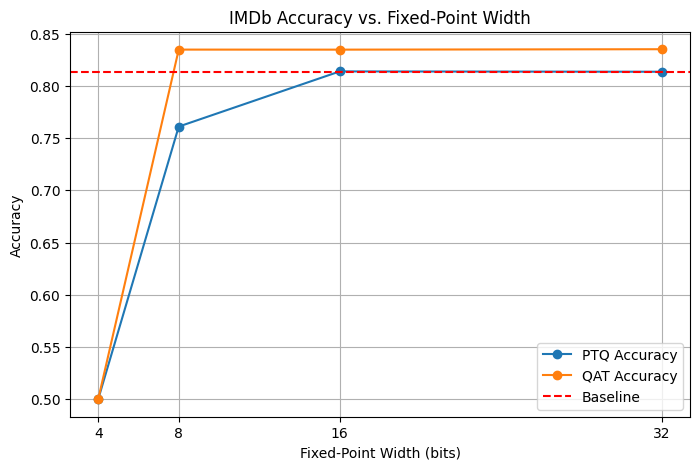

## Lab1

### Task1 Quantization Exploration

config used:

```python
quantization_config = {
    "by": "type",
    "default": {
        "config": {
            "name": None,
        }
    },
    "linear": {
        "config": {
            "name": "integer",
            # data
            "data_in_width": width,
            "data_in_frac_width": width//2,
            # weight
            "weight_width": width,
            "weight_frac_width": width//2,
            # bias
            "bias_width": width,
            "bias_frac_width": width//2,
        }
    },
}
```

The plot of two accuracy curves for PTA and QAT is shown below. QAT shows higher accuracy compared to PTQ because further training after quantization compensates for the information loss introduced. In addition, for both PTQ and QAT, accuracy increases as fixed-point width increases but only starts to drop significantly around 8 bits. This suggests significant redundancy exists in the network; most parameters are not sensitive to small errors introduced by quantization. 





### Task2 Pruning Exploration

Pruning config:

```python
pruning_config = {
    "weight": {
        "sparsity": sparsity,
        "method": strategy,
        "scope": "local",
    },
    "activation": {
        "sparsity": sparsity,
        "method": strategy,
        "scope": "local",
    },
}
```

**L‐norm pruning** ranks weights by the sum of their absolute values. Weights with smaller absolute values are assumed less important and are pruned first. Although this assumption might not be true in all cases, this generally preserves parameters that have the greatest impact on the model’s predictions.

**Random pruning** simply drops a percent of parameters at random, with no regard for their importance.

For both pruning methods, increased sparsity leads to lower accuracy, this drop is accelerated as sparsity approaches 1, until accuracy approaches 50%, equal to random guess. Also, L1-norm has much better performance compared to random pruning. This is because L‐norm pruning prune weight with small values first, which are likely to be less important, while Random pruning prune weight at random, is more likely to prune important weights and cause more accuracy drops.

The plot of accuracies for pruning with different sparsity and strategies is shown below. 


## Lab2 Neural Architecture Search

### Part 1 Compare Different Sampler

A comparison of the maximum accuracy achieved by different samplers is shown below. From the plot, all three methods (Grid, Random, and TPE) ultimately get roughly the same peak accuracy (~0.87). The difference is how quickly each sampler approaches the peak:

1. GridSampler begins moderately high and proceeds possible search space step-by-step. This method ensures coverage but can be slow and difficult to achieve optimal solution if the parameter space is large.

2. RandomSampler also starts near a good solution (purely by chance) and proceeds erratically. Only one improvement is observed, but the improvement is huge and leads to a near-optimum result. This illustrates how random search often does surprisingly well over many trials but lacks the directed improvement, hence performance varies a lot under different conditions due to its randomness.

3. TPESampler starts lower but quickly catches up to and matches the other two. TPE uses prior results to guide subsequent sampling more intelligently. We can observe more rapid improvements in the result and the highest final accuracy. The low initial accuracy is common for probabilistic samplers because early draws might land on less‐optimal parts of the search space.

In conclusion, the TPE sampler outperformed other sampler due to its efficiency and stability.


### Part 2 Compression Aware NAS

As shown in the Figure below, the NAS no compression achieves the highest accuracy across all trials. By contrast, the compression-aware NAS without post-compression training shows a notable drop in accuracy during the initial trials. Although its performance improves over later trials, it remains below that of the no-compression baseline. Finally, the compression-aware NAS with post-compression training surpasses the performance of the no-post-compression approach but still has lower accuracy than the no-compression NAS overall trial.


## Lab 3 Mixed Precision Search

### Task 1 Mixed Precision Search

The figure below demonstrates the highest accuracy achieved in mixed precision search using the TPE Sampler, which was shown to be optimal in lab 2.


### Task 2 

As shown in the below diagram, each precision's accuracy is plotted independently. For most precision, the final accuracy is very similar, around 86%. LinearBinaryResidualSign and LinearBinary show a significantly low accuracy during the first 10 trials (around 50%), while LinearBinary remains at a low precision level throughout the 50 trials. 

Log‐based layers use a logarithmic representation of parameters to maintain a wide dynamic range while simplifying multiplications to additions in the log domain; minifloat‐based layers employ a reduced floating‐point format to compress parameter storage and computation; and integer‐based layers quantize parameters to integers to exploit efficient integer‐only hardware. In the experiments, their maximum achievable accuracies all end up quite close—generally within a few tenths of a percentage point, indicating that these different precision schemes each provide similar performance.

LinearBinary's poor performance can be explained by its limited representation ability, as it only has a single‐bit weight (±1) with no learned scaling or offset. Other binary‐type layers (e.g. "LinearBinaryScaling" or "LinearBinaryResidualSign") do learn additional per‐channel scale factors or offsets, giving them more expressive power. 


Here's a zoomed image:


## Lab4

### Part 1 torch.compile()

When torch.compile(model) is called, PyTorch will simply returns a  wrapper around the original model, no solid work is done. The actual optimisation won't happened until the first forward pass. When `output = model(inputs)` actually called, **TorchDynamo** will construct a FX-graph of the model, and **TorchInductor** will further compiles the FX graphs into optimized kernels. These steps will cause overhead when the compiled model is run for the first time. We can see from the image below that, the compiled model has significant overhead at the first iteration, both on CPU and GPU.


|  |  |
|:-------------------------------------:|:-------------------------------------:|
| **CPU Accelerations**                 | **GPU Accelerations**                 |


Once the compiled model runs for the first time, later calls will not need to recompile the model. For any later iterations, the compiled model is faster than the original model. For small data sizes, this speed-up is not enough to cover the optimization overhead, this is what we observed. But as data sizes increase, accumulated time for the original model eventually exceeds the compiled model. The same thread happened for GPU, as shown below:

|  |  |
|:-------------------------------------:|:-------------------------------------:|
| **CPU Accelerations**                 | **GPU Accelerations**                 |.


### Part 2 Fused Kernel

On the CPU, the fused SDPA kernel runs significantly faster compared to naive implementation, and the same pattern can be observed on the GPU, as shown in the comparison diagram below.


### Part 3 Custom Kernal

#### *Q1 MXINT8 benefit for custom hardware*

1. Reduced Memory and Bandwidth
Each group of mantissa stores just one exponent, so there is less data per value (fewer bits per mantissa plus a single exponent). This cuts down both on-chip and off-chip memory usage. For example, with the same on-chip memory, GPU can load more data at once, avoid frequent access to external memory (which is slow), and hence improve calculation efficiency.

2. Faster Matrix Operations
Because the exponent scaling is shared within each group, hardware can apply that scaling once per group rather than per individual value. This reduces overhead in multiplication calculation and can lead to more efficient matrix multiplications.


#### *Q2 The purpose of the variable dont_need_abs and bias*

MXINT8 has 8 shared exp bits, 8 mantissa bits (1 signed bit and 7 frac bits)

BF16 has 1 signed bit, 8 exp bits, and 7 fraction bits. It also has an implicit leading bit, which is not stored. During calculation, this bit is added at the highest bit of fraction bits. If all exp bits are zero, implicit leading bits are set to 0, fraction bits have a value of 0.xxx, and 1 otherwise, faction bits have a value of 1.xxx.

MXINT has no mantissa bits, hence the highest bit of fraction parts can be seen as replacement. `dont_need_abs` indicates the 7-bit of fraction bits is 1 or 0. Fraction part value = frac/64, so when the bit = 1, fraction bits have value 1.xxx, 0.xxx otherwise. 

Mathematically, the formula for these two forms is:
For MXINT:

$$
\mathrm{MXINT}(s,e,m) \;=\;
\mathrm{Sign} \;\times\; 2^{\,E - 127} \;\times\; \mathrm{Frac}.
$$

For a BF16 number in **normal form**:

$$
\mathrm{BF16}(s,e,m) \;=\; \text{Sign}\;\times\;2^{\,E - 127}\;\times\;\bigl(1 + \text{Frac}\bigr).
$$


When converting MXINT into BF16, if dont_need_abs = True, nothing change is needed as implicit bits are 1. During the conversion, 7-bit of the fraction bits will be removed due to overflow, and default implicit bits = 1 will lead to the same final value. In the formula, MXINT's Frac value becomes Frac - 1 in BF16, and compensated by 1+ in BF16 formula.

If dont_need_abs = False, the conversion will add an additional 1 (implicit bit) to the fraction part. To remove this value, we need to minus a bias. According to the BF16's equation, we need to minus 
$$ \mathrm{Sign} \times 2^{E - 127} \times 1 $$

In BF16 form, this is equal to set fraction bits to 0, with sign and exponent bits unchanged.

``` c++
auto dont_need_abs = bool(mantissa_abs & 0x40)
auto bias = cutlass::bfloat16_t::bitcast(sign | exp | uint16_t(0));
y[i] = dont_need_abs ? out : out - bias;
```

----
#### Q3 How does cta_tiler partition data for copying to shared memory in CUDA kernel? How does layout_sX partition threads in a threadlock for computation? (Challenge)

**cta_tiler**
```c++
auto cta_tiler = make_shape(BLK_M, BLK_K);
auto cta_coord = make_coord(blockIdx.x, blockIdx.y);
Tensor gX = local_tile(mX, cta_tiler, cta_coord);
```
- `mX`: global tensor, here we assume it represents a 2d tensor
- `cta_tiler`: a Tiler (a Shape to be specific). It has shape if (BLK_M, BLK_K). Each thread block (CTA) should handle a sub-tile 2d-data block of this shape.
- `cta_coord`: 2d coordinates represent which tile we want to choose. The global senior is divided into a grid of shape `cta_tiler`, and `cta_tiler` represents a node on the grid, leading to a tile.
- `local_tile`: select the tile from mX at coordinate `cta_coord`, and return the selected data.

In conclusion:
1. The global tensor is divided into a grid of tiles of size `cta_tiler` (BLK_M×BLK_K). 
2. Each thread block (CTA) is assigned one tile at coordinate `cta_coord` (blockIdx.x, blockIdx.y)
3. `local_tile` select the tile from mX at coordinate `cta_coord`. The selected date is assigned to the tensor object `gx`. 
4. In the latter process, data will be copied from global memory to shared memory.


**layout_sX**
```c++
auto layout_sX = make_layout(make_shape(BLK_M, BLK_K));
auto tXsX = local_partition(sX, layout_sX, threadIdx.x);
```
In CuTe, a layout is basically a function from coordinates to a linear offset.
- `layout_sX` represents a function, mapping input coordinates (m, k) to an offset value, which leads to a (BLK_M, BLK_K) tile. Here, it maps thread-Id to coordinates to a sub-datablock.
- `sX` is 2D view of the shared-memory tile of shape `cta_tile` (BLK_M,BLK_K) for a threadblock to process.
- `threadIdx.x` is the unique 1D thread identifier within the threadblock.
- `tXsX`: represents just the slice of (BLK_M, BLK_K) that threadIdx.x is assigned to handle.

`local_partition` does the following:
1. takes the shared-memory tile sX of shape (BLK_M, BLK_K).
2. applies zipped_divide internally with layout_sX, creating as many “sub-tiles” as there are threads according to layout_sX.size().
3. Pick the sub-tile data corresponding to the current thread index (threadIdx.x).

----
#### Q4 Why the saved GPU memory is not exactly (32 - (4+8/32))/32 = 86.7%?
1. (32 - (4+8/32))/32 = 86.7% should be theoretical memory save for MXINT4. For MXINT8, since Mantissa has 8 bits, the correct calculation should be (32 - (8+8/32))/32 = 74.2%

2. **Not all layers are quantized**
 ```cpp
    for layer_name, layer in model.named_modules():
        if not isinstance(layer, torch.nn.Linear):
            continue
        if "classifier" in layer_name:
            continue
 ```
 In layer replacement code, only nn.Linear and non-classification layers are replaced. For a transformer model, many layers remain unquantized, e.g. Embedding Layers, Final Classification Layer, and Normalization Layers.

<!-- 2. Alignment, padding

    Quantized data is often stored with some alignment for efficient memory access (e.g., multiples of 256 bytes). This alignment adds “wasted” bytes that do not scale linearly with the nominal bits/parameter. -->


<!-- #### Q3 How does cta_tiler partition data for copying to shared memory in CUDA kernel? How does layout_sX partition threads in a threadlock for computation? (Challenge)
The `cta_tiler` works by taking a larger data layout, a 1D or 2D range of elements, and mathematically “dividing” it into sub-layouts that each fit within a single CTA’s workload. In other words, it composes (in the CuTe sense) a tile shape (representing the desired per-block sub-range) with the global layout of the data, which effectively slices out exactly the portion of data each block (CTA) will copy into shared memory. Once a CTA has its tile, `layout_sX` describes how the threads within that block are partitioned among the tile’s elements: it is simply another CuTe layout, this time for threads, that further divides the CTA tile so each thread gets a distinct subset of indices to process. By composing the CTA tile layout with this thread layout, we map each `(threadIdx.x, threadIdx.y)` to its own slice of data for both loading into shared memory and performing computations, all orchestrated through CuTe’s algebra of shape, stride, composition, and divide. -->